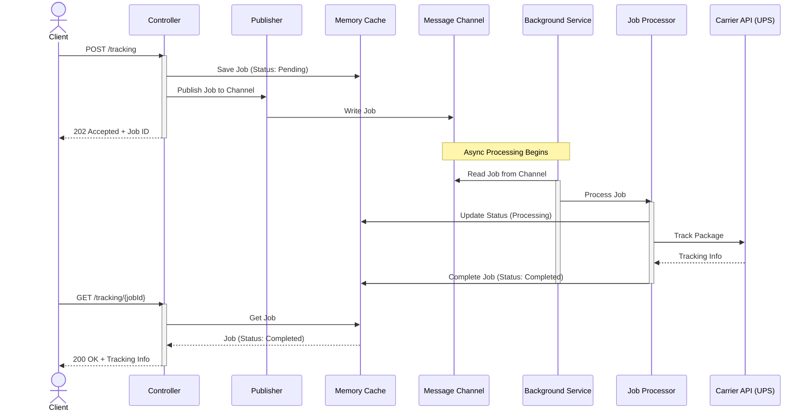
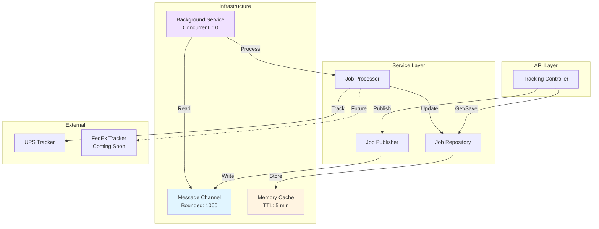
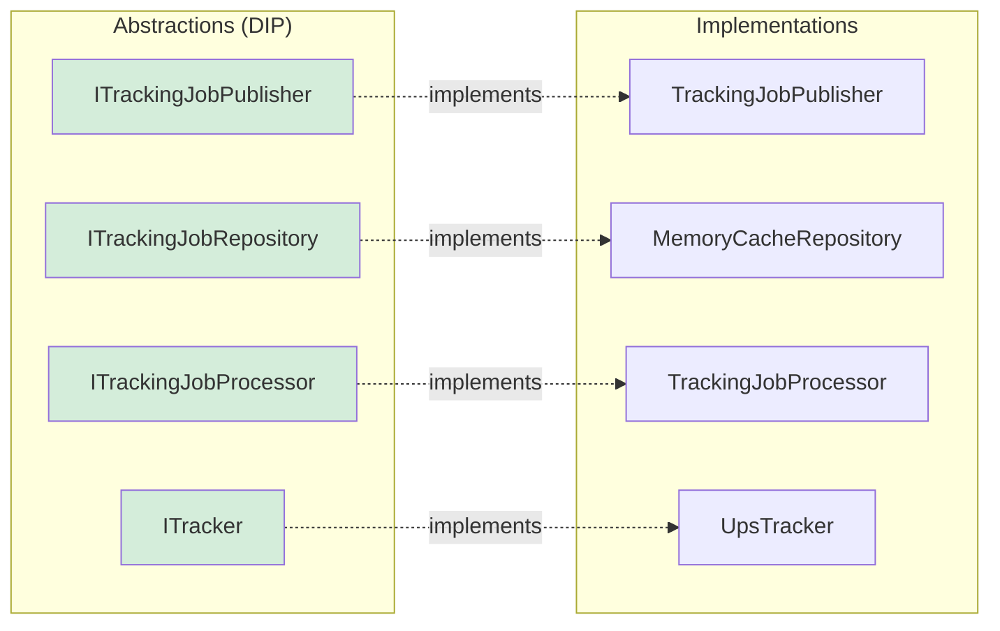

# Tracking API

A production-ready asynchronous package tracking API built with .NET 8, supporting multiple carriers with a scalable pub/sub architecture.

[](https://dotnet.microsoft.com/)
[](LICENSE)

---

## Table of Contents

- [Overview](#overview)
- [Architecture](#architecture)
- [Features](#features)
- [Getting Started](#getting-started)
- [API Documentation](#api-documentation)
- [Configuration](#configuration)
- [SOLID Principles](#solid-principles)
- [Future Enhancements](#future-enhancements)

---

## Overview

The Tracking API transforms synchronous package tracking into a high-performance asynchronous system. Instead of blocking while waiting for carrier APIs, the system accepts tracking requests immediately and processes them in the background using a channel-based pub/sub pattern.

### Why Async?

- **Scalability**: Handle thousands of requests without blocking
- **Resilience**: Client requests succeed even if carrier APIs are slow
- **Performance**: Non-blocking responses improve throughput
- **User Experience**: Clients can poll for results at their convenience

---

## Architecture

### System Flow Diagram



### Component Architecture



### SOLID Design



---

## Features

### ✅ Core Features

- **Asynchronous Processing**: Background job processing with channel-based message queue
- **Multiple Carriers**: Extensible architecture supporting UPS (FedEx coming soon)
- **Temporary Caching**: 5-minute result storage with automatic expiration
- **Concurrent Processing**: Process up to 10 jobs simultaneously
- **Rate Limiting**: Per-API-key rate limiting and daily quotas
- **Error Handling**: User-friendly error messages with proper HTTP status codes

### 🔒 Production Ready

- **SOLID Principles**: Clean architecture with interface-based design
- **Dependency Injection**: Proper service lifetime management
- **Structured Logging**: Comprehensive logging with Serilog
- **API Documentation**: Swagger/OpenAPI documentation
- **Health Checks**: Endpoint for monitoring
- **Graceful Shutdown**: Background service completes in-flight jobs

### 📊 Observability

- **Request Correlation**: Unique job IDs for tracking
- **Structured Logs**: JSON-formatted logs with context
- **Performance Metrics**: Job processing duration logging
- **Error Tracking**: Failed jobs captured with error messages

---

## Getting Started

### Prerequisites

- [.NET 8 SDK](https://dotnet.microsoft.com/download/dotnet/8.0)
- Code editor (Visual Studio, VS Code, or Rider)

### Installation

1. **Clone the repository**

```bash
git clone https://github.com/yourusername/tracking-api.git
cd tracking-api
```

2. **Configure settings**

Edit `Source/appsettings.json`:

```json
{
  "AppSettings": {
    "XApiKey": "your-api-key-here",
    "Urls": {
      "UpsMain": "https://www.ups.com/track?loc=en_US&requester=ST/",
      "UpsTrack": "https://webapis.ups.com/track/api/Track/GetStatus?loc=en_US"
    },
    "Tracking": {
      "ChannelCapacity": 1000,
      "CacheExpirationMinutes": 5,
      "MaxConcurrentProcessing": 10,
      "ProcessingDelayMs": 100
    }
  }
}
```

3. **Build and run**

```bash
dotnet build
dotnet run --project Source/Tracking.Api.csproj
```

4. **Access Swagger UI**

Navigate to: `https://localhost:5001/swagger`

### Quick Test

```bash
# Submit a tracking request
curl -X POST https://localhost:5001/tracking \
  -H "Content-Type: application/json" \
  -H "x-api-key: test" \
  -d '{
    "trackingNumber": "1Z999AA10123456784",
    "carrierCode": "UPS"
  }'

# Response
{
  "jobId": "3fa85f64-5717-4562-b3fc-2c963f66afa6",
  "status": "Pending",
  "statusUrl": "/tracking/3fa85f64-5717-4562-b3fc-2c963f66afa6",
  "expiresAt": "2025-11-29T22:35:00.000Z"
}

# Check status (wait a few seconds)
curl https://localhost:5001/tracking/3fa85f64-5717-4562-b3fc-2c963f66afa6 \
  -H "x-api-key: test"
```

---

## API Documentation

### Endpoints

#### `POST /tracking`

Submit a tracking request for asynchronous processing.

**Request Body:**
```json
{
  "trackingNumber": "1Z999AA10123456784",
  "carrierCode": "UPS"
}
```

**Response:** `202 Accepted`
```json
{
  "jobId": "guid",
  "status": "Pending",
  "statusUrl": "/tracking/{jobId}",
  "expiresAt": "2025-11-29T22:35:00.000Z"
}
```

#### `GET /tracking/{jobId}`

Check the status of a tracking job.

**Responses:**

- `200 OK` - Job completed successfully (includes tracking result)
- `202 Accepted` - Job still processing (poll again)
- `410 Gone` - Job expired (>5 minutes old)
- `500 Internal Server Error` - Job failed (includes error message)

**Example Success Response:**
```json
{
  "jobId": "guid",
  "status": "Completed",
  "result": {
    "trackingNumber": "1Z999AA10123456784",
    "carrier": "UPS",
    "status": "Delivered",
    "deliveryDate": "2025-11-29T15:30:00Z",
    "eventList": [...]
  },
  "errorMessage": null,
  "completedAt": "2025-11-29T22:30:00.000Z"
}
```

For complete API documentation, see [API Usage Guide](docs/api-usage-guide.md).

---

## Configuration

### Environment Settings

All configuration is in `appsettings.json` under `AppSettings`:

```json
{
  "AppSettings": {
    "XApiKey": "test",
    "RateLimit": 50,
    "RateLimitTimeInMinutes": 1,
    "DailyLimit": 990,
    "Urls": {
      "UpsMain": "https://www.ups.com/...",
      "UpsTrack": "https://webapis.ups.com/..."
    },
    "Tracking": {
      "ChannelCapacity": 1000,
      "CacheExpirationMinutes": 5,
      "MaxConcurrentProcessing": 10,
      "ProcessingDelayMs": 100
    }
  }
}
```

### Configuration Options

| Setting | Default | Description |
|---------|---------|-------------|
| `ChannelCapacity` | 1000 | Max jobs in queue before dropping oldest |
| `CacheExpirationMinutes` | 5 | How long to cache results |
| `MaxConcurrentProcessing` | 10 | Max jobs processed simultaneously |
| `ProcessingDelayMs` | 100 | Delay between job processing (rate limiting) |
| `RateLimit` | 50 | Requests per minute per API key |
| `DailyLimit` | 990 | Daily request limit per API key |

---

## SOLID Principles

The implementation strictly follows SOLID design principles:

### Single Responsibility Principle (SRP)

- **Publisher**: Only publishes jobs to channel
- **Repository**: Only manages cache operations
- **Processor**: Only processes tracking logic
- **Background Service**: Only reads channel and coordinates
- **Controller**: Only handles HTTP concerns

### Open/Closed Principle (OCP)

- Adding new carriers requires implementing `ITracker` interface
- No modification to existing processor code
- Strategy pattern for carrier selection

### Liskov Substitution Principle (LSP)

- All `ITracker` implementations are interchangeable
- Repository can be swapped (MemoryCache → Redis → Database)

### Interface Segregation Principle (ISP)

- Separate interfaces: `ITrackingJobPublisher`, `ITrackingJobRepository`, `ITrackingJobProcessor`
- Controllers only depend on what they need
- No "fat" interfaces

### Dependency Inversion Principle (DIP)

- All services depend on abstractions (interfaces)
- No direct dependencies on concrete implementations
- DI container manages object creation

---

## Project Structure

```
Tracking.Api/
├── Source/
│   ├── Core/
│   │   ├── Configuration/      # Settings and options
│   │   ├── Constants/          # Application constants
│   │   ├── Enums/             # Enums (CarrierCode, TrackingStatus, etc.)
│   │   ├── Interfaces/        # Service abstractions
│   │   ├── Mappers/           # Data transformation
│   │   ├── Models/            # Domain models
│   │   ├── RequestModels/     # API request DTOs
│   │   ├── ResponseModels/    # API response DTOs
│   │   ├── Services/          # Core business logic
│   │   └── Startup/           # DI registration
│   ├── Infrastructure/
│   │   ├── BackgroundServices/ # Background workers
│   │   └── Repositories/       # Data access implementations
│   ├── Presentation/
│   │   ├── Controllers/        # API endpoints
│   │   └── Middlewares/        # HTTP middleware
│   ├── Program.cs              # Application entry point
│   └── appsettings.json        # Configuration
├── docs/
│   ├── async-tracking-implementation-plan.md  # Implementation plan
│   └── api-usage-guide.md                     # API usage guide
└── README.md                                   # This file
```

---

## Technology Stack

- **.NET 8**: Modern C# framework
- **System.Threading.Channels**: High-performance pub/sub
- **IMemoryCache**: In-memory caching
- **Serilog**: Structured logging
- **Swagger/OpenAPI**: API documentation
- **Background Services**: Hosted services for async processing

---

## Performance Considerations

### Channel Capacity

The bounded channel capacity (1000) prevents unbounded memory growth. When full, the oldest jobs are dropped (DropOldest policy).

### Concurrent Processing

10 concurrent jobs balance throughput and resource usage. Increase for more throughput, decrease for resource-constrained environments.

### Cache Expiration

5-minute cache expiration:
- **Sliding**: Resets on each access
- **Absolute**: Hard limit at 10 minutes (2x sliding)

This prevents stale data while allowing reasonable polling windows.

### Rate Limiting

Rate limiting prevents abuse:
- 50 requests/minute per API key
- 990 requests/day per API key

---

## Monitoring and Observability

### Logging

Structured JSON logs include:

```json
{
  "Timestamp": "2025-11-29T22:30:00.000Z",
  "Level": "Information",
  "MessageTemplate": "Processing tracking job {JobId} for {TrackingNumber}",
  "Properties": {
    "JobId": "3fa85f64-5717-4562-b3fc-2c963f66afa6",
    "TrackingNumber": "1Z999AA10123456784",
    "Carrier": "UPS"
  }
}
```

### Key Log Events

- Job submission
- Job processing start
- Job processing completion
- Job failures
- Background service lifecycle

### Health Check

```bash
curl https://localhost:5001/health
```

---

## Future Enhancements

### Planned Features

1. **Additional Carriers**
   - FedEx integration
   - USPS integration
   - DHL integration

2. **Distributed Caching**
   - Replace MemoryCache with Redis
   - Support multi-instance deployments
   - Shared cache across servers

3. **Persistent Queue**
   - Replace Channel with RabbitMQ/Azure Service Bus
   - Survive application restarts
   - Guaranteed delivery

4. **Webhook Callbacks**
   - Client provides callback URL
   - Notify when job completes
   - Eliminate polling

5. **Request Deduplication**
   - Cache identical requests
   - Return existing job ID
   - Reduce redundant processing

6. **Circuit Breaker**
   - Polly integration
   - Protect against carrier API failures
   - Automatic retry with backoff

7. **Telemetry**
   - OpenTelemetry integration
   - Distributed tracing
   - Performance metrics

8. **Batch Processing**
   - Submit multiple tracking numbers
   - Process as single job
   - Bulk result retrieval

---

## Contributing

Contributions are welcome! Please:

1. Fork the repository
2. Create a feature branch
3. Make your changes
4. Add tests (when test infrastructure is added)
5. Submit a pull request

---

## License

This project is licensed under the MIT License.

---

## Acknowledgments

Built with modern .NET best practices and SOLID principles. Special thanks to the .NET community for excellent patterns and libraries.

---

**Status**: ✅ Production Ready  
**Version**: 1.0.0  
**Last Updated**: November 2025
